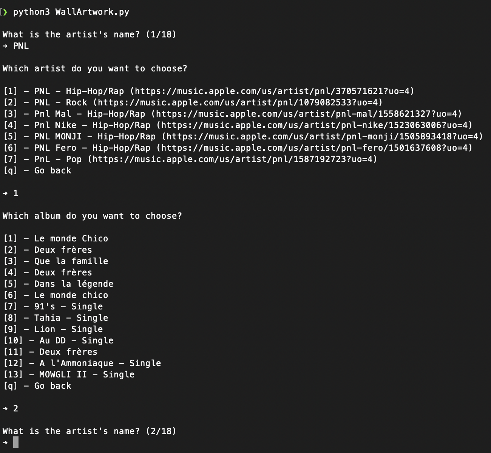

# WallArtwork

WallArtwork is a Python script that automatically download and puts album artworks from [iTunes Search API](https://affiliate.itunes.apple.com/resources/documentation/itunes-store-web-service-search-api/) into an image.

## Installation

Use the package manager [pip](https://pip.pypa.io/en/stable/) to install the depedency [Pillow](https://github.com/python-pillow/Pillow).

```bash
pip install pillow
```

## Usage

Just run the [Python script](WallArtwork.py).

```bash
python WallArtwork.py
```

The script will ask you artist name and album name for each artwork (18 for a 1080 × 1920 image).

> 

## Result

The script will produce a 1080 × 1920 image named `background.png` containing 18 album covers arranged in 3 columns of 6 covers each

> 

## License

[MIT](https://choosealicense.com/licenses/mit/)
